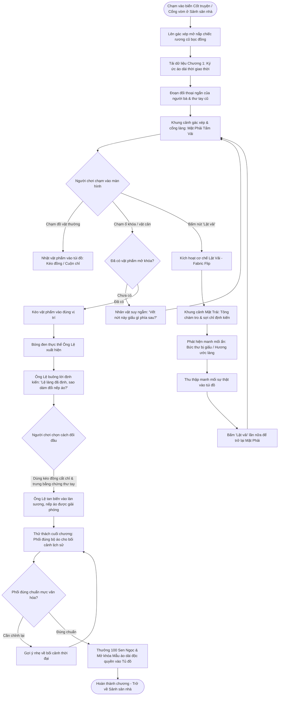

# Luồng Thao Tác Người Dùng (User Flows)

Tài liệu này trực quan hóa hai luồng trải nghiệm người dùng trọng tâm nhất trong ứng dụng Tiệm May Nếp bằng sơ đồ Mermaid:
1. Luồng chính từ khi mở ứng dụng, tiếp cận thẻ bắt đầu tại sảnh sân nhà, vào Phòng phối đồ thử nghiệm trang phục và tạo bộ ảnh Lookbook chân thực để chia sẻ.
2. Luồng trải nghiệm một chương game giải đố point-and-click tại phân khu Cốt truyện (chiếc rương cũ trên gác xép) kết hợp cơ chế Lật vải (Fabric Flip).

## 1. Luồng từ mở App đến tạo và chia sẻ Lookbook

Sơ đồ thể hiện chu trình xuyên suốt từ bước tiếp cận tại sảnh sân nhà, tạo diện mạo hoặc dạo quanh ngay, vào Phòng phối đồ thử nghiệm trang phục theo sự kiện, nhận đánh giá hài hòa màu sắc và xuất kết quả lookbook do Gemini tạo ra.

```mermaid
flowchart TD
    Start([Mở ứng dụng trên trình duyệt]) --> CheckUser{Đã lưu tùy biến nhân vật trong LocalStorage?}
    
    %% Hub & Onboarding Flow
    CheckUser -- Chưa --> HubNew[Vào thẳng Sảnh sân nhà: Hiện thẻ 'Bắt đầu câu chuyện của bạn']
    HubNew --> Choice{Người dùng chọn hướng đi}
    Choice -- Dạo quanh sân nhà --> ExploreNow[Dạo quanh ngay với nhân vật mẫu áo dài trắng]
    Choice -- Tạo nhân vật từ ảnh --> ModalAvatar[Mở bảng tạo nhân vật pixel]
    ModalAvatar --> PickGender[Người dùng tự chọn giới tính Nam/Nữ]
    PickGender --> AvatarMethod{Phương thức tạo diện mạo}
    AvatarMethod -- Chọn mẫu có sẵn --> PickPreset[Chọn kiểu tóc, màu da, kính mắt thủ công]
    AvatarMethod -- Tải ảnh selfie --> UploadSelfie[Tải ảnh selfie từ thiết bị]
    UploadSelfie --> CallGeminiSelfie[Gemini chỉ trích xuất đặc điểm tóc/kính]
    CallGeminiSelfie --> BuildAvatar[Ghép sprite nhân vật pixel áo dài trắng]
    PickPreset --> BuildAvatar
    BuildAvatar --> SaveLocal[Lưu trạng thái vào LocalStorage & hiện diện giữa sân]
    ExploreNow --> HubReady[Sảnh sân nhà hoàng hôn pixel art]
    SaveLocal --> HubReady
    
    %% Hub Navigation
    CheckUser -- Đã có --> HubReady
    HubReady --> ClickStudio[Chạm vào biển gỗ Phòng phối đồ bên trái]
    
    %% Studio Workflow
    ClickStudio --> StudioScreen[Phân khu Phòng phối đồ Studio]
    StudioScreen --> SelectEvent[Chọn ngữ cảnh sự kiện: Tết / Cưới / Bế giảng / Lễ chùa / Viếng tang]
    StudioScreen --> Customize[Tùy biến: Chọn phom áo, màu sắc truyền thống, phụ kiện]
    Customize --> LiveRender[Cập nhật nhân vật tức thì trên Canvas]
    LiveRender --> CheckRules[Hệ thống chạy thước đo màu & 5 luật văn hóa]
    
    CheckRules --> CultureAlert{Có vi phạm quy tắc văn hóa?}
    CultureAlert -- Có --> ShowWarning[Hiển thị thẻ nhắc nhở nhẹ nhàng kèm giải thích]
    CultureAlert -- Không --> CatAdvice[Mèo Nếp vẫy đuôi khen & gợi ý thêm 3 bộ]
    ShowWarning --> ActionChoice{Người dùng chọn bước tiếp theo}
    CatAdvice --> ActionChoice
    
    %% Lookbook & Share
    ActionChoice -- Lưu đồ --> SaveCloset[Cất bộ đồ vào Tủ đồ cá nhân]
    ActionChoice -- So sánh --> SplitCompare[Mở chế độ so sánh 2 bộ đồ song song]
    ActionChoice -- Tạo Lookbook --> TriggerLookbook[Bấm nút 'Tạo Lookbook Studio']
    
    TriggerLookbook --> CallGeminiImage[Gọi Model sinh ảnh: Tạo 4 góc nhìn chân thực]
    CallGeminiImage --> CheckGenResult{Tạo ảnh thành công?}
    CheckGenResult -- Thành công --> ShowModal[Hiển thị 4 ảnh studio có dán nhãn 'Ảnh do AI tạo']
    CheckGenResult -- Quá tải / Lỗi --> FallbackCard[Xuất thẻ ảnh Polaroid pixel art sắc nét]
    ShowModal --> ShareAction[Bấm nút tải ảnh về máy hoặc chia sẻ]
    FallbackCard --> ShareAction
    ShareAction --> BackHub[Quay lại Sảnh sân nhà]
```

## 2. Luồng trải nghiệm một chương game giải đố (Cốt Truyện - Chiếc Rương Cũ)

Sơ đồ thể hiện chu trình người chơi khám phá ký ức lịch sử tại một chương game point-and-click, ứng dụng cơ chế Lật vải để tháo gỡ định kiến làng xã và mở khóa y phục độc quyền.

